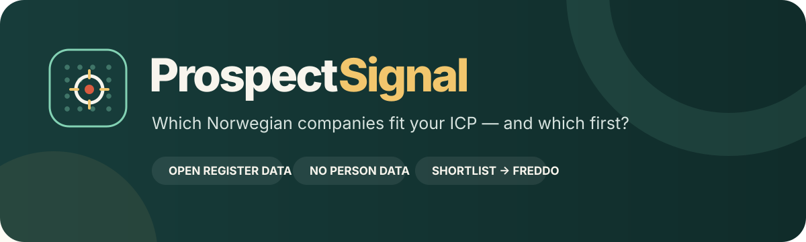
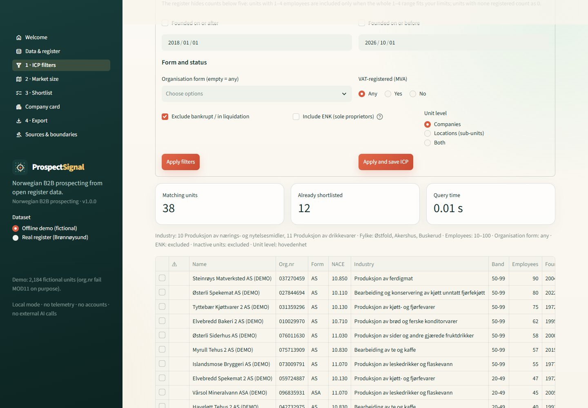

<p align="center">
  
</p>

<p align="center">
  
  
  <a href="LICENSE"></a>
</p>

<p align="center"><strong>Norwegian B2B prospecting from open Brønnøysund data: ideal-customer filters, market size and shortlists, run locally.</strong></p>

> **Name status:** the name “ProspectSignal” has not been screened for trademarks or existing products yet. Treat it as a working name until it has been checked.

**ProspectSignal** is an open, local-first prospecting tool for the Norwegian market, built on Enhetsregisteret, the open company register published by Brønnøysundregistrene. It is a free alternative to paid tools such as Proff Forvalt, Vainu, Enin and Infobel for small sales and marketing teams. It asks:

> Which Norwegian companies fit our ideal customer profile, how big is that market, and which ones should we look at first?

Everything runs on your computer with open-source Python packages. There is no account, telemetry, advertising, external AI call or cloud upload. The only network calls are to Brønnøysundregistrene, and only when you ask for them.

<p align="center"></p>

## Read this first

ProspectSignal works with **companies, never people**.

- It never reads roles (board members, CEO, contact persons), e-mail addresses or phone numbers, even though the register publishes some of them.
- Sole proprietorships (ENK) usually carry the owner's name, so ENK is excluded by default, flagged when included, and its street address is never stored.
- **Registry data never implies marketing consent.** The shortlist and export screens say so, and the export is preceded by an outreach checklist sourced from Forbrukertilsynet, Datatilsynet, Lovdata and Brønnøysundregistrene. The checklist is not legal advice.
- There is no scraping of websites, LinkedIn or Proff. Open register data only.

## Try the offline demo in three minutes

1. Start the app (see *Run locally*). It opens with about 2,000 fictional companies; no network needed.
2. Open **1 · ICP filters**. The demo ICP is “Fjellbrus — food & beverage producers, former Viken, 10–100 employees” for the fictional beverage brand Fjellbrus. Read the matching count.
3. Open **2 · Market size** for counts by county (with a map), industry, size band and registration year.
4. Back on **ICP filters**, tick a few rows and press **Add selected to shortlist**.
5. Open **3 · Shortlist**, set statuses and notes, and try the fit-score weights.
6. Open **4 · Export**, read the outreach checklist, tick the acknowledgement, and download the Freddo CSV or the XLSX workbook.

Demo companies are generated by code. Their names end in “(DEMO)”, their organisation numbers start with 0 and **fail the MOD11 check on purpose** (so they can never match a real unit, and Freddo's validator rejects them), and their websites use the reserved `.example` domain. Kommune numbers and names are real so the region filters behave as they do on real data.

## Load the real register

On **Data & register**, press **Load real register**. ProspectSignal downloads the official nightly bulk file (`/enhetsregisteret/api/enheter/lastned/csv`, about 155 MB gzip, ~1.2 million units) with a progress bar and indexes it into a local DuckDB file in about 10–30 seconds. Underenheter (branches and other locations) are an optional extra download. The download date is stored on every row; the raw file is deleted after indexing.

On the real register, a typical ICP query returns counts and a shortlist in well under a second (the demo ICP took 0.05 s on 1,176,284 units on 1 October 2026).

Single companies can be refreshed from the REST API (`/api/enheter/{orgnr}`, falling back to `/api/underenheter/{orgnr}`). A unit that is no longer in open data is removed from the local copy, as the API documentation requires.

## What you can filter on

| Filter | Notes |
|---|---|
| Industry (NACE / SN2025) | Any level of the hierarchy: section `C`, division `10`, group `10.1`, class `10.11`, subclass `10.110`. Optionally match secondary codes. Code names from SSB. |
| Fylke / kommune | Counties after the 2024 reform. “Viken (former)” is an alias for Østfold, Akershus and Buskerud. |
| Employees | Minimum/maximum. The register hides counts below five, so 1–4 employees are included only when the whole 1–4 range fits your limits. |
| Founded | Date range on `stiftelsesdato` (or `oppstartsdato` for sub-units). |
| Organisation form | AS, ASA, ANS, DA, SA, NUF, … ENK must be included deliberately. |
| VAT-registered | Any / yes / no. |
| Status | Bankrupt, under liquidation and closed sub-units are excluded by default. |
| Unit level | Companies (hovedenheter), locations (underenheter) or both. |

Filter sets can be saved as named ICPs.

## Shortlist and fit score

Each shortlisted company has a status (*new, researching, qualified, not a fit, sent to CRM*) and free-text notes. The optional fit score is a weighted share of four checks — size band in your targets, county in your targets, industry match (main code = 1, secondary code only = ½), and age in your range — scaled to 0–100. The weights are sliders on screen and every component is shown next to the total. It is a sorting aid, not a prediction.

## Export to Freddo CRM

ProspectSignal never writes into Freddo. You export a file and decide in Freddo whether to import it; people are never part of the bridge.

The **Freddo CSV** has the header on the first line, UTF-8 without BOM, every value quoted, organisation numbers and postcodes as text with leading zeros intact, and these columns:

`organization_name, org_nr, entity_kind, parent_org_nr, nace, nace_description, employee_band, street_address, region_postcode, poststed, kommune, fylke, website, brreg_source, brreg_refreshed_at`

They follow the fields Freddo adds to Frappe CRM's *CRM Organization* (`org_nr`, `entity_kind`, `parent_org_nr`, `nace`, `employee_band`, `region_postcode`) plus the upstream `organization_name` and `website`. Attribution and download date travel in every row (`brreg_source`, `brreg_refreshed_at`) because a leading comment line would break a header-first importer. See [docs/freddo-import.md](docs/freddo-import.md) for the open questions about Freddo's importer, which is planned but not yet built.

The **XLSX workbook** contains the shortlist with status and notes, a *Source & licence* sheet (attribution, licence, download date, consent note), the ICP used, and the outreach checklist. All exported cells are sanitised against spreadsheet formula injection.

## Sources and licences

| Data | Source | Licence |
|---|---|---|
| Company register | Enhetsregisteret, Brønnøysundregistrene ([API docs](https://data.brreg.no/enhetsregisteret/api/dokumentasjon/no/index.html)) | [NLOD 2.0](https://data.norge.no/nlod/no/2.0) |
| Industry code names | SN2025, Statistics Norway (SSB) Klass, classification 6 | [CC BY 4.0](https://www.ssb.no/diverse/lisens) |
| County map | Administrative enheter fylker, Kartverket (simplified) | CC BY 4.0 |

Attribution used in the app and every export: *«Inneholder data under Norsk lisens for offentlige data (NLOD) tilgjengeliggjort av Brønnøysundregistrene. ProspectSignal har filtrert dataene og avledet ansattintervall og fylke.»* Every external fact the code relies on is listed with its source and date in [docs/sources.md](docs/sources.md), including the open `TODO(verify)` items.

## Run locally

You need Python 3.10 or newer and a local copy of this folder.

**Windows:** double-click `run_app.bat`. **macOS:** double-click `run_app.command`.

The first launch creates a private `.venv` and installs the open-source dependencies; later launches reuse it. On Windows, if the first launch stops with *“The filename or extension is too long”* (WinError 206), the folder path is too deep for Windows' 260-character limit: move the folder somewhere shorter (for example `C:\Code\b2b-prospecting`), delete `.venv`, and launch again.

Or use a terminal:

```bash
python -m venv .venv
source .venv/bin/activate  # Windows: .venv\Scripts\activate
python -m pip install -r requirements.txt
python -m streamlit run app.py
```

ProspectSignal uses local port `8589`. Set `PROSPECTSIGNAL_PORT` to choose another, `PROSPECTSIGNAL_DATA_DIR` to keep the databases elsewhere (default `./data`, git-ignored), `PROSPECTSIGNAL_CHECKLIST` to use your own checklist YAML, or `PROSPECTSIGNAL_DEBUG=1` to reveal technical error details.

HTTPS certificates are checked against your operating system's trust store (`truststore`), so the download also works on machines where antivirus or corporate HTTPS inspection adds its own root certificate. Verification is never switched off.

### Docker

```bash
docker build -t prospectsignal .
docker run --rm -p 8589:8589 -v prospectsignal-data:/data prospectsignal
```

Then open `http://127.0.0.1:8589`. The container runs as a non-root user, keeps its databases in the `/data` volume and includes a health check.

## Use it as a package

The logic lives in `src/prospectsignal/` and does not import Streamlit, so it can be reused (for example in a merged Signal Hub):

```python
from prospectsignal import ICP, Store, demo_icp, load_demo, freddo_csv_bytes

store = Store("data/demo.duckdb")
load_demo(store)
icp = ICP(name="Bryggerier", nace_prefixes=("11.05",), fylker=("31", "32"), employees_min=5)
print(store.count(icp))
store.add_to_shortlist(store.query(icp)["org_nr"].head(10).tolist(), icp.name)
open("shortlist.csv", "wb").write(freddo_csv_bytes(store.shortlist_frame()))
```

All database access sits behind `prospectsignal.storage.Store`, so another engine can replace DuckDB without touching the rest.

## Privacy

ProspectSignal stores company facts only, on your computer. See [PRIVACY.md](PRIVACY.md) for exactly what is and is not stored, and why ENK rows need care.

## Development checks

```bash
python -m pip install -e ".[test]"
python -m pytest
python -m ruff check .
python -m build
```

Tests use recorded API responses and the recorded bulk-file header with fictional rows; a guard fails any test that tries a live network call. The suite covers organisation numbers as strings with MOD11, leading-zero postcodes, Æ/Ø/Å round trips, the NACE hierarchy filter, ENK exclusion, the absence of person fields in storage and export, the Freddo CSV format, the outreach checklist's sources, the architecture rules (no Streamlit under `src/`, SQL only in `storage.py`), and every Streamlit page.

## Relationship to the Signal suite

ProspectSignal is part of the [Signal suite](https://ulrikerlingsen.com/) of local-first marketing tools.

- **Freddo CRM** manages relationships. Its rule: *NACE counts may size a market; they never become a contact list.* ProspectSignal is the separate tool where a deliberate shortlist is allowed, and the bridge is one-way and manual.
- **TrackSignal**, **SeasonSignal**, **CreatorSignal** and **ListenSignal** share the same house style, privacy stance and explicit boundaries.

## License

The software and documentation are free under **AGPL-3.0-or-later**. See [LICENSE](LICENSE). Register data remains under NLOD 2.0, SSB code names and Kartverket boundaries under CC BY 4.0.

This application was developed with AI coding assistance and checked through source review, recorded-fixture tests, a full real-register load and visual inspection. Verify material decisions independently; no warranty is provided. The outreach checklist is not legal advice.
